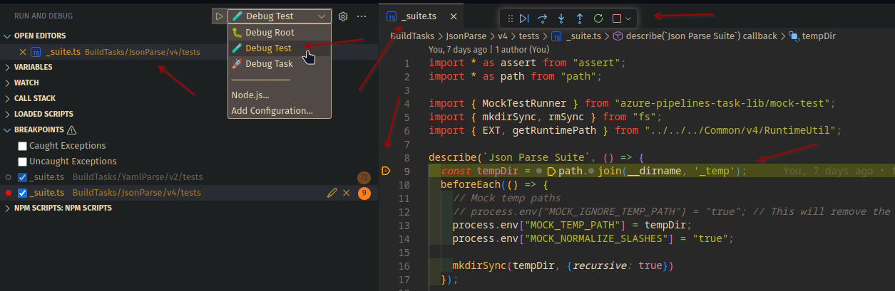

<pre class="language-filetree vscode-light">
<code>├─📁 <span class="hlft-string">.azuredevops</span>..: <span class="hlft-comment"> </span>
│ ├─ <span class="hlft-keyword">azure-pipeline.yml</span>.: <span class="hlft-comment"># pipeline yaml</span>
├─📁 <span class="hlft-string">scripts</span>.............: <span class="hlft-comment"># utility scripts for develomnent lifecycle only</span>
├─ <span class="hlft-keyword">new-task.ts</span>..........: <span class="hlft-comment"># script to create an new Task (</span><code>npm run new:task</code><span class="hlft-comment">) !</span>
├─📁 <span class="hlft-string">BuildTasks</span>..........: <span class="hlft-comment"># Put your tasks <span class="hlft-strong">here!</span></span>
│ ├─📁 <span class="hlft-string">Common</span>............: <span class="hlft-comment"># IS NOT an task here has your commons functions to all tasks!</span>
│ │ ├─📁 <span class="hlft-string">v1</span>..............: <span class="hlft-comment"># Package Major version!</span>
│ │ │ ├─ <span class="hlft-keyword">Common.ts</span>......: <span class="hlft-comment"># 🧰 This is common func (must referenced in ./BuildTasks/tsconfig.v1.json)!</span>
│ │ │ ├─ <span class="hlft-keyword">tsconfig.json</span>..: <span class="hlft-comment"> </span>
│ │ │ ├─📁 <span class="hlft-string">tests</span>.........: <span class="hlft-comment"> </span>
│ │ │  ├─ <span class="hlft-keyword">_suite.ts</span>.....: <span class="hlft-comment"># 🧪 all your tests must stay here!</span>
│ ├─📁 <span class="hlft-string">MyFirstTask</span>.......: <span class="hlft-comment"># This is an TASK package!</span>
│ │ ├─📁 <span class="hlft-string">v1</span>..............: <span class="hlft-comment"># Package Major version!</span>
│ │ │ ├─ <span class="hlft-keyword">MyFirstTask.ts</span>.: <span class="hlft-comment"># 🔨 This is your task!</span>
│ │ │ ├─ <span class="hlft-keyword">icon.png</span>.......: <span class="hlft-comment"># Task Icon must be and .png </span>
│ │ │ ├─ <span class="hlft-keyword">task.json</span>......: <span class="hlft-comment"># task manifest file</span>
│ │ │ ├─ <span class="hlft-keyword">tsconfig.json</span>..: <span class="hlft-comment"> </span>
│ │ │ ├─📁 <span class="hlft-string">tests</span>.........: <span class="hlft-comment"> </span>
│ │ │  ├─ <span class="hlft-keyword">_suite.ts</span>.....: <span class="hlft-comment"># 🧪 all your tests must stay here!</span>
├─ <span class="hlft-keyword">vss-extension.json</span>...: <span class="hlft-comment"># 📚 Extension manifest file</span>
├─ <span class="hlft-keyword">package.json</span>.........: <span class="hlft-comment"> </span>
└─ <span class="hlft-keyword">.gitignore</span>...........: <span class="hlft-comment"> </span>
</code></pre>


## Get Start

Common Root scripts:

```bash
# Install all dependencies of all packages in project.
npm i

# Remove all files in .gitignore (node_modules, test-results.xml, *.vsix...).
npm run clean

# Compile all tasks and modules.
npm run build

# Compile and test all tasks and modules.
npm run test

# Compile, test and scan coverage on all tasks and modules.
npm run coverage

# Based on conventinal commits, bump all versioned files on .versionrc.js.
npm run release

# Same that 'release' and push commits and tags.
npm run release:full

# Clean, reinstall dependencies, build, optimise dependencies, package vsix and reinstall all dependencies.
npm run package

# CLI util to create an new Task.
npm run new:task

```

## Full publish scripts
```bash
npm run clean && npm i && npm run coverage && npm run release:full && npm run package && npm run pub
# or
npm run coverage && npm run release:full && npm run package && npm run pub

```

### Combinacao windows por partes

```bash
npm run clean
npm i --ignore-scripts=true

cd BuildTasks/Base64/v4 && npm i && npm run compile && npm i --omit=dev && cd -
cd BuildTasks/NunjucksInline/v4 && npm i && npm run compile && npm i --omit=dev && cd -
cd BuildTasks/NunjucksRender/v4 && npm i && npm run compile && npm i --omit=dev && cd -
cd BuildTasks/RegexReplace/v4 && npm i && npm run compile && npm i --omit=dev && cd -
cd BuildTasks/UUID/v4 && npm i && npm run compile && npm i --omit=dev && cd -

npm run release && npx tfx-cli extension create --root . --manifest-globs vss-extension.json

git push --follow-tags origin main

npm run pub

```

## Debug

Debug modes are:
* `Debug Test`: Choose an `_suite.ts` file and start.
* `Debug Task`: Choose an `Task.ts` file and start.
* `Debug Root`: Choose any `typescript` file and stat.




<style>

/*
https://raw.githubusercontent.com/isagalaev/highlight.js/master/src/styles/vs2015.css
*/
/*
 * Visual Studio 2015 dark style
 * Author: Nicolas LLOBERA <nllobera@gmail.com>
 */


.hlft-keyword,
.hlft-literal,
.hlft-symbol,
.hlft-name {
	color: #569CD6;
}
.hlft-link {
	color: #569CD6;
	text-decoration: underline;
}

.hlft-built_in,
.hlft-type {
	color: #4EC9B0;
}

.hlft-number,
.hlft-class {
	color: #B8D7A3;
}

.hlft-string,
.hlft-meta-string {
	color: #D69D85;
}

.hlft-regexp,
.hlft-template-tag {
	color: #9A5334;
}

.hlft-subst,
.hlft-function,
.hlft-title,
.hlft-params,
.hlft-formula {
	color: #DCDCDC;
}

.hlft-comment,
.hlft-quote {
	color: #57A64A;
	font-style: italic;
}

.hlft-doctag {
	color: #608B4E;
}

.hlft-meta,
.hlft-meta-keyword,
.hlft-tag {
	color: #9B9B9B;
}

.hlft-variable,
.hlft-template-variable {
	color: #BD63C5;
}

.hlft-attr,
.hlft-attribute,
.hlft-builtin-name {
	color: #9CDCFE;
}

.hlft-section {
	color: gold;
}

.hlft-emphasis {
	font-style: italic;
}

.hlft-strong {
	font-weight: bold;
}

/*.hlft-code {
	font-family:'Monospace';
}*/

.hlft-bullet,
.hlft-selector-tag,
.hlft-selector-id,
.hlft-selector-class,
.hlft-selector-attr,
.hlft-selector-pseudo {
	color: #D7BA7D;
}

.hlft-addition {
	background-color: var(--vscode-diffEditor-insertedTextBackground, rgba(155, 185, 85, 0.2));
	color: rgb(155, 185, 85);
	display: inline-block;
	width: 100%;
}

.hlft-deletion {
	background: var(--vscode-diffEditor-removedTextBackground, rgba(255, 0, 0, 0.2));
	color: rgb(255, 0, 0);
	display: inline-block;
	width: 100%;
}


/*
From https://raw.githubusercontent.com/isagalaev/highlight.js/master/src/styles/vs.css
*/
/*

Visual Studio-like style based on original C# coloring by Jason Diamond <jason@diamond.name>

*/

.vscode-light .hlft-function,
.vscode-light .hlft-params,
.vscode-light .hlft-number,
.vscode-light .hlft-class  {
	color: inherit;
}

.vscode-light .hlft-comment,
.vscode-light .hlft-quote,
.vscode-light .hlft-number,
.vscode-light .hlft-class,
.vscode-light .hlft-variable {
	color: #008000;
}

.vscode-light .hlft-keyword,
.vscode-light .hlft-selector-tag,
.vscode-light .hlft-name,
.vscode-light .hlft-tag {
	color: #00f;
}

.vscode-light .hlft-built_in,
.vscode-light .hlft-builtin-name {
	color: #007acc;
}

.vscode-light .hlft-string,
.vscode-light .hlft-section,
.vscode-light .hlft-attribute,
.vscode-light .hlft-literal,
.vscode-light .hlft-template-tag,
.vscode-light .hlft-template-variable,
.vscode-light .hlft-type {
	color: #a31515;
}

.vscode-light .hlft-selector-attr,
.vscode-light .hlft-selector-pseudo,
.vscode-light .hlft-meta,
.vscode-light .hlft-meta-keyword {
	color: #2b91af;
}

.vscode-light .hlft-title,
.vscode-light .hlft-doctag {
	color: #808080;
}

.vscode-light .hlft-attr {
	color: #f00;
}

.vscode-light .hlft-symbol,
.vscode-light .hlft-bullet,
.vscode-light .hlft-link {
	color: #00b0e8;
}


.vscode-light .hlft-emphasis {
	font-style: italic;
}

.vscode-light .hlft-strong {
	font-weight: bold;
}

</style>
